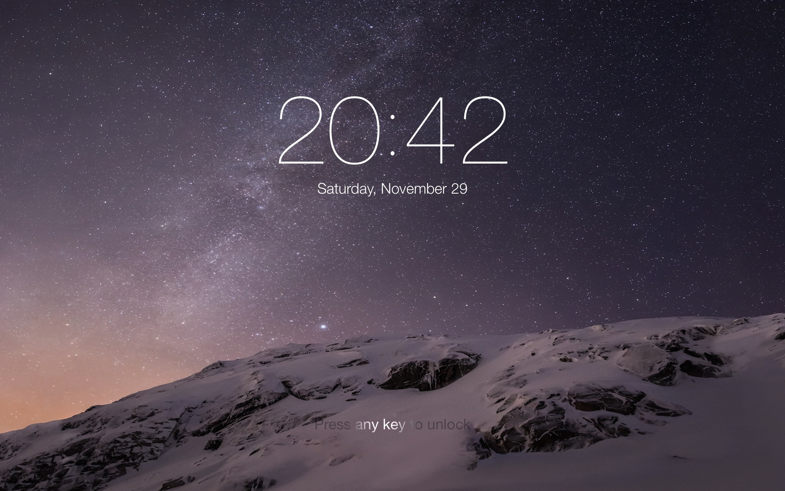

# 🚨 Incompatible with macOS Mojave 🚨

Quartz Composer (`.qtz`) screen savers do not work in macOS Mojave 10.14 (released in September 2018). Along with hundreds of others, this screen saver will not work. 😔

Please [let me know](https://github.com/lgarron/ios-lockscreensaver/issues/3) if you know a workaround.

# iOS Lockscreensaver for OSX

The [iOS lockscreen screensaver by `bodysoulspirit`](http://bodysoulspirit.weebly.com/ios-screensaver-for-osx.html) is by far my favorite OSX screensaver. It emulates the lockscreen introduced on iOS 7, and provides for an understated, classy look on a computer monitor.

My changes:

- Improve the timing of the white highlight on "Press any key to unlock".
- Fix time font on Yosemite.
- Subtle star twinkling.

